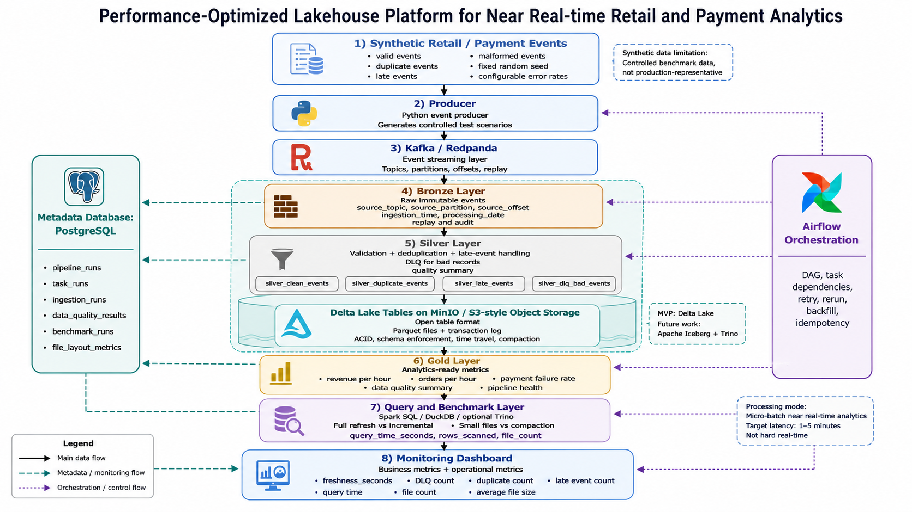

# Performance-Optimized Lakehouse Platform

> Nền tảng Lakehouse tối ưu hiệu năng cho phân tích dữ liệu bán lẻ/thanh toán gần thời gian thực.

## 1. Giới thiệu ngắn gọn

Project này xây dựng một nền tảng dữ liệu theo kiến trúc Lakehouse để mô phỏng bài toán xử lý dữ liệu bán lẻ/thanh toán gần thời gian thực.

Project không chỉ dừng ở việc lắp nhiều công cụ như Kafka, Spark, Delta Lake, Airflow và Streamlit. Mục tiêu chính là giải quyết các vấn đề thực tế của một data platform:

- dữ liệu đến liên tục theo dạng event stream;
- dữ liệu có thể bị duplicate do retry hoặc rerun;
- dữ liệu có thể đến muộn so với thời điểm nghiệp vụ;
- dữ liệu có thể sai schema hoặc không hợp lệ;
- full refresh dễ đúng nhưng chậm khi dữ liệu tăng;
- micro-batch có thể sinh nhiều small files làm query chậm;
- retry/rerun trong orchestration có thể gây double count nếu task không idempotent;
- dashboard có thể stale nếu không theo dõi freshness.

## 2. Tên đề tài

**Tên tiếng Việt:**

Xây dựng và đánh giá nền tảng Lakehouse tối ưu hiệu năng cho phân tích dữ liệu bán lẻ/thanh toán gần thời gian thực.

**Tên tiếng Anh:**

Design and Evaluation of a Performance-Optimized Lakehouse Platform for Near Real-time Retail and Payment Analytics.

## 3. Bài toán kinh doanh

Trong hệ thống bán lẻ/thanh toán, các sự kiện như `order_created`, `payment_authorized`, `payment_failed`, `refund_requested` có thể phát sinh liên tục. Business cần theo dõi các chỉ số như:

- doanh thu theo giờ/ngày;
- số lượng đơn hàng theo giờ/ngày;
- tỷ lệ thanh toán thất bại;
- số lượng event lỗi;
- độ trễ dữ liệu;
- tình trạng sức khỏe của pipeline.

Nếu pipeline không xử lý duplicate events, revenue có thể bị double count. Nếu không xử lý late events, metrics theo giờ có thể bị thiếu dữ liệu. Nếu không có data quality gate, malformed records có thể đi vào Gold layer và làm dashboard sai.

Vì vậy, project thiết kế một pipeline Lakehouse gồm Bronze, Silver, Gold, benchmark và monitoring để chứng minh không chỉ dữ liệu chạy được, mà còn đúng, có thể audit, có thể benchmark và có thể vận hành an toàn hơn.

## 4. Kiến trúc tổng thể

```text
Synthetic Retail / Payment Events
        ↓
Producer
valid + duplicate + late + malformed events
        ↓
Kafka
Event streaming layer
        ↓
Bronze Layer
Raw immutable events + source offset + ingestion metadata + replay
        ↓
Silver Layer
Validation + deduplication + late-event flag + DLQ + quality summary
        ↓
Delta Lake Tables
Transaction log + schema enforcement/evolution + compaction
        ↓
Gold Layer
Business metrics + data quality metrics + pipeline health metrics
        ↓
Benchmark Layer
Full refresh vs incremental
Small files vs compaction
        ↓
Airflow Orchestration
Retry + backfill + idempotent rerun
        ↓
Monitoring Dashboard
Freshness + DLQ + duplicate + query time + file count
```

## 5. Chế độ xử lý dữ liệu

Project này là **micro-batch near real-time analytics**, không phải hard real-time.

Mục tiêu latency:

```text
1–5 phút
```

Điều này nghĩa là dữ liệu được đọc liên tục từ Apache Kafka KRaft nhưng được xử lý theo các batch nhỏ. Project không claim xử lý từng event ở mức millisecond.

Lý do chọn micro-batch:

- phù hợp với dashboard retail/payment;
- dễ triển khai hơn hard real-time;
- phù hợp với Spark Structured Streaming;
- đủ tốt để mô phỏng near real-time analytics;
- giúp tập trung vào correctness, benchmark và trade-off thay vì tối ưu latency cực thấp.

## 6. Vì sao chọn Lakehouse?

Data Lake thuần có ưu điểm lưu trữ linh hoạt và chi phí thấp, nhưng dễ yếu ở transaction, schema management, data quality và query optimization.

Data Warehouse mạnh cho BI/dashboard nhưng không tự nhiên cho raw event stream, replay, data science/ML và file layout optimization.

Lakehouse phù hợp với project này vì kết hợp được:

- raw storage để audit/replay;
- table format để quản lý metadata và transaction;
- schema enforcement/evolution;
- batch và streaming workload;
- SQL analytics;
- benchmark query performance;
- khả năng mở rộng sang AI/ML use cases.

## 7. Tech stack

| Thành phần | Công nghệ | Vai trò |
|---|---|---|
| Local environment | Docker Compose | Chạy nhiều service local |
| Event streaming | Apache Kafka KRaft | Mô phỏng event stream |
| Producer | Python | Sinh synthetic events |
| Object storage | MinIO Community source build | Mô phỏng S3-compatible storage local |
| Processing | Spark/PySpark | Xử lý Bronze → Silver → Gold |
| Table format | Delta Lake | Transaction log, schema, compaction |
| Metadata database | PostgreSQL | Lưu pipeline runs, benchmark results, quality results |
| Orchestration | Airflow | DAG, retry, rerun, backfill |
| Dashboard | Streamlit | Monitoring dashboard |
| Testing | pytest | Unit/data/correctness tests |
| CI nhẹ | GitHub Actions | Chạy tests và config checks |

### 7.1. Kafka topic design

Topic chính của project:

| Thuộc tính | Giá trị |
|---|---|
| Topic name | `retail-payment-events` |
| Partitions | `3` |
| Replication factor | `1` |
| Retention | `604800000 ms` — 7 ngày |
| Cleanup policy | `delete` |
| Record key mẫu | `order_id` |
| Record value | JSON retail/payment event |

Luồng dữ liệu tối thiểu trong Tuần 1:

```text
Synthetic producer
        ↓
retail-payment-events
        ↓
Kafka CLI consumer
```

#### Bootstrap servers

Tùy vị trí chạy client, địa chỉ Kafka khác nhau:

| Client | Bootstrap server |
|---|---|
| Ứng dụng chạy trên Windows host | `localhost:9092` |
| Service chạy trong Docker network | `kafka:19092` |
| Kafka CLI chạy trong Kafka container | `localhost:19092` |

Không sử dụng IP container cố định vì IP có thể thay đổi sau khi container được tạo lại.

#### Partition strategy

Topic sử dụng `3` partition để:

- minh họa cơ chế phân vùng dữ liệu;
- chuẩn bị cho consumer group và xử lý song song;
- cho phép các event có cùng key được định tuyến ổn định;
- chuẩn bị cho Spark Structured Streaming ở các tuần sau.

Trong MVP, `order_id` được dùng làm Kafka record key mẫu. Các event của cùng một đơn hàng thường được đưa vào cùng partition, giúp duy trì thứ tự của chúng trong partition đó.

Kafka chỉ bảo đảm thứ tự record trong cùng một partition, không bảo đảm thứ tự trên toàn bộ topic.

#### Retention và local limitation

Project local chỉ chạy một Kafka broker nên:

```text
replication.factor = 1
```

Cấu hình này phù hợp với môi trường học tập và phát triển local nhưng không cung cấp high availability. Trong production cần nhiều broker và replication factor lớn hơn `1`.

Topic sử dụng:

```text
cleanup.policy = delete
retention.ms = 604800000
```

Kafka giữ event trong thời gian retention, kể cả khi consumer đã đọc. Bronze layer mới là nơi lưu raw data lâu dài để phục vụ audit và replay.

## 8. Bronze/Silver/Gold design

### 8.1. Bronze Layer

Bronze lưu raw immutable events từ Apache Kafka KRaft.

Bronze không sửa dữ liệu, không drop duplicate, không sửa schema lỗi.

Mục tiêu:

- audit;
- replay;
- debug upstream;
- trace source offset;
- giữ bằng chứng dữ liệu gốc.

Các field quan trọng:

```text
event_id
event_type
raw_payload
source_topic
source_partition
source_offset
event_time
producer_time
ingestion_time
processing_date
schema_version
ingestion_run_id
```

### 8.2. Silver Layer

Silver xử lý dữ liệu để tạo clean events và các bảng phụ phục vụ audit.

Silver outputs:

```text
silver_clean_events
silver_duplicate_events
silver_late_events
silver_dlq_bad_events
silver_quality_summary
```

Rules bắt buộc:

- `event_id` not null;
- `event_id` unique trong clean output;
- `event_type` thuộc danh sách hợp lệ;
- `event_time` not null;
- `amount >= 0`;
- `currency in ['VND', 'USD']`;
- `payment_id` not null với payment events;
- `schema_version` được hỗ trợ;
- `raw_payload` parse được.

### 8.3. Gold Layer

Gold chứa dữ liệu đã sẵn sàng cho analytics/dashboard.

Gold tables:

```text
gold_order_metrics_hourly
gold_order_metrics_daily
gold_payment_metrics_hourly
gold_pipeline_health
gold_data_quality_summary
```

Gold metrics cần có correctness tests để chứng minh:

- revenue không bị double count;
- bad events không vào Gold;
- payment failure rate tính đúng;
- freshness_seconds được ghi nhận;
- rerun không tạo duplicate output.

## 9. Data quality checks

Project kiểm soát dữ liệu ở Silver layer.

Các nhóm lỗi chính:

| Nhóm lỗi | Ví dụ | Cách xử lý |
|---|---|---|
| Missing required field | `event_id = null` | Đưa vào DLQ |
| Invalid amount | `amount < 0` | Đưa vào DLQ |
| Invalid currency | `currency = ABC` | Đưa vào DLQ |
| Unsupported schema | `schema_version = v99` | Đưa vào DLQ |
| Duplicate event | Trùng `event_id` | Đưa vào duplicate table |
| Late event | Đến muộn quá ngưỡng | Flag hoặc đưa vào late table |

## 10. Deduplication và late events

### 10.1. Deduplication

Dedup key chính:

```text
event_id
```

Mục tiêu:

- mỗi event nghiệp vụ chỉ được tính một lần;
- duplicate event không làm revenue tăng;
- duplicate records vẫn được lưu ở bảng riêng để audit.

### 10.2. Late events

Project phân biệt:

```text
event_time      = thời điểm nghiệp vụ xảy ra
producer_time   = thời điểm producer gửi event
ingestion_time  = thời điểm platform nhận event
```

Policy mặc định:

```text
allowed_lateness_minutes = 30
```

Late events trong ngưỡng cho phép có thể được xử lý và cập nhật Gold metrics. Late events quá ngưỡng được flag hoặc đưa vào late table để debug/backfill.

## 11. Delta Lake table format

MVP chọn Delta Lake làm table format chính cho Silver và Gold.

Lý do:

- dễ tích hợp với Spark local;
- có transaction log;
- hỗ trợ ACID transactions;
- hỗ trợ schema enforcement/evolution;
- hỗ trợ time travel;
- hỗ trợ merge/update/delete;
- phù hợp benchmark small files vs compaction.

Iceberg được xem là future work vì có các điểm mạnh như hidden partitioning và partition evolution, nhưng đưa vào MVP có thể làm scope quá rộng.

## 12. Benchmark methodology

Benchmark không chạy một lần rồi kết luận. Project dùng methodology có kiểm soát.

Nguyên tắc:

1. Mỗi experiment chạy ít nhất 3 lần.
2. Có warm-up run nếu cần.
3. Dùng fixed random seed.
4. Cố định data volume.
5. Lưu Spark config.
6. Lưu table layout.
7. Lưu query text hoặc query hash.
8. Lưu run_id.
9. Không so sánh hai experiment nếu input data khác nhau.
10. Không kết luận chỉ dựa trên một lần chạy.

Metrics chuẩn:

```text
run_id
experiment_name
strategy_name
data_volume
random_seed
spark_config
table_layout
query_name
query_hash
run_number
processing_time_seconds
query_time_seconds
rows_scanned
rows_written
file_count
average_file_size_mb
compaction_runtime_seconds
correctness_status
created_at
```

## 13. Benchmark 1: Full refresh vs incremental

Research question:

```text
Incremental processing cải thiện processing_time_seconds và rows_scanned so với full refresh như thế nào?
```

Full refresh:

- đọc lại toàn bộ Silver;
- tính lại toàn bộ Gold;
- dễ đúng hơn nhưng chậm khi dữ liệu lớn.

Incremental:

- chỉ xử lý dữ liệu mới hoặc affected windows;
- dùng MERGE/upsert thay vì append mù;
- nhanh hơn trong nhiều trường hợp nhưng phức tạp hơn.

Trade-off:

```text
Full refresh dễ đúng nhưng không scale tốt.
Incremental scale tốt hơn nhưng cần unique key, idempotency, late-event handling và backfill strategy.
```

## 14. Benchmark 2: Small files vs compaction

Research question:

```text
Small files ảnh hưởng query_time_seconds, file_count và average_file_size_mb như thế nào?
Compaction cải thiện query performance như thế nào và tốn thêm compaction_runtime_seconds ra sao?
```

Small files scenario:

- micro-batch ghi nhiều file nhỏ;
- query phải list/open/read metadata nhiều file;
- query time tăng.

Compaction scenario:

- gộp nhiều file nhỏ thành ít file lớn hơn;
- giảm file_count;
- tăng average_file_size;
- có thể giảm query_time;
- nhưng tốn compaction_runtime_seconds.

Trade-off:

```text
Compaction cải thiện read/query performance nhưng tốn maintenance cost.
```

## 15. Airflow retry và idempotency

Airflow dùng để orchestrate pipeline, không dùng để xử lý dữ liệu lớn trực tiếp.

DAG dự kiến:

```text
generate_events
        ↓
ingest_to_bronze
        ↓
validate_bronze
        ↓
process_silver_incremental
        ↓
run_quality_checks
        ↓
build_gold_metrics
        ↓
run_incremental_benchmark
        ↓
run_compaction_benchmark
        ↓
update_monitoring_summary
```

Yêu cầu quan trọng:

- task có retry policy;
- rerun cùng `processing_date` không tạo duplicate;
- data quality fail thì dừng trước Gold;
- backfill không làm sai metrics ngày khác;
- logs có run_id, task_name, status, input_rows, output_rows.

## 16. Monitoring dashboard

Dashboard gồm 2 nhóm.

### 16.1. Business overview

- revenue_per_hour;
- orders_per_hour;
- payment_failure_rate.

### 16.2. Operational monitoring

- freshness_seconds;
- pipeline_success_rate;
- last_successful_run;
- dlq_count;
- duplicate_count;
- late_event_count;
- quality_pass_rate;
- processing_time_seconds;
- query_time_seconds;
- file_count;
- average_file_size_mb;
- compaction_runtime_seconds.

Operational dashboard giúp trả lời câu hỏi: pipeline có khỏe không, dữ liệu có stale không, DLQ có spike không, duplicate có tăng không, query có chậm đi không, file count có tăng bất thường không.

## 17. Dataset design và limitations

Project dùng synthetic retail/payment events với fixed random seed và configurable error rates.

Producer config cần có:

```text
random_seed
data_volume
duplicate_rate
late_event_rate
malformed_rate
negative_amount_rate
unsupported_schema_version_rate
skew_mode
```

Synthetic data giúp chủ động tạo tình huống test:

- duplicate events;
- late events;
- malformed records;
- negative amount;
- unsupported schema version;
- small files;
- skew mode.

Limitation:

- không đại diện tuyệt đối cho production;
- benchmark local không phản ánh hoàn toàn cloud workload;
- MinIO chỉ mô phỏng S3-compatible storage;
- cần validate lại với dữ liệu thật nếu triển khai production.

## 18. Trade-offs chính

Project phải giải thích rõ các trade-off sau:

| Trade-off | Ý nghĩa |
|---|---|
| Bronze immutable vs storage cost | Giữ raw để replay/audit nhưng tốn storage |
| Strict data quality gate vs pipeline availability | Gate chặt giúp metrics đúng nhưng có thể làm pipeline dừng |
| Late-event threshold ngắn vs dài | Ngắn thì fresh hơn, dài thì đúng hơn với late events |
| Full refresh vs incremental | Full refresh dễ đúng, incremental scale tốt hơn |
| Small files vs compaction | Compaction query nhanh hơn nhưng tốn maintenance runtime |
| Delta Lake MVP vs Iceberg future work | Delta dễ hoàn thành MVP, Iceberg tốt cho lakehouse đa engine |
| Airflow retry vs duplicate risk | Retry tăng reliability nhưng cần idempotency |
| Synthetic data control vs generalizability | Dễ kiểm soát test nhưng không đại diện tuyệt đối production |
| Micro-batch simplicity vs sub-second latency | Micro-batch dễ triển khai nhưng không phải hard real-time |

## 19. Cấu trúc repo

```text
optimized-retail-lakehouse-platform/
  README.md
  docker-compose.yml
  docker-compose.ci.yml
  Makefile
  .env.example

  producer/
  ingestion/
  processing/
  lakehouse/
  quality/
  benchmark/
  orchestration/
  monitoring/
  sql/
  tests/
  docs/
  report/
  slides/
  demo/
```

## 20. Cách chạy local

### 20.1. Yêu cầu

- Docker Desktop và Docker Compose;
- Git;
- Python 3.11 cho các script chạy trên host;
- PowerShell hoặc Git Bash trên Windows.

### 20.2. Chuẩn bị biến môi trường

Tạo file `.env` từ file mẫu:

```bash
cp .env.example .env
```

Điền credential local trong `.env`. Không commit `.env` hoặc các file password được sinh trong `orchestration/config/`.

Kiểm tra cấu hình Compose:

```bash
docker compose config
```

### 20.3. Khởi động local infrastructure

```bash
docker compose up -d --build
docker compose ps
```

Các endpoint mặc định:

| Service | Endpoint |
|---|---|
| Kafka trên host | `localhost:9092` |
| PostgreSQL | `localhost:5432` |
| MinIO S3 API | `http://localhost:9000` |
| MinIO Console | `http://localhost:9001` |
| Spark Master UI | `http://localhost:8080` |
| Airflow UI | `http://localhost:8088` |
| Streamlit | `http://localhost:8501` |

Port thực tế có thể được thay đổi trong `.env`.

### 20.4. Khởi tạo MinIO và kiểm tra PostgreSQL

Tạo bucket `lakehouse` và chạy S3 put/get smoke test:

```bash
python scripts/create_buckets.py
```

Kiểm tra các bảng metadata PostgreSQL:

```bash
docker compose exec postgres \
  psql \
  -U "$POSTGRES_USER" \
  -d "$POSTGRES_DB" \
  -c "\dt"
```

Nếu Git Bash chưa nạp biến từ `.env`:

```bash
set -a
source .env
set +a
```

Các bảng metadata tối thiểu của Tuần 1:

```text
pipeline_runs
data_quality_results
benchmark_runs
```

### 20.5. Khởi tạo Kafka topic

Tạo hoặc đồng bộ cấu hình topic:

```bash
make create-topics
```

Kiểm tra topic:

```bash
make describe-topic
```

Kết quả mong đợi:

```text
Topic: retail-payment-events
PartitionCount: 3
ReplicationFactor: 1
retention.ms=604800000
cleanup.policy=delete
```

### 20.6. Kafka smoke test

Gửi một JSON event mẫu có record key:

```bash
make kafka-produce-sample
```

Đọc event và hiển thị key, timestamp, partition và offset:

```bash
make kafka-consume-sample
```

Hoặc chạy toàn bộ Kafka smoke test:

```bash
make kafka-smoke
```

Với Kafka CLI phiên bản mới:

- `kafka-console-producer.sh` dùng `--reader-property`;
- `kafka-console-consumer.sh` dùng `--formatter-property`;
- không dùng `--property` vì tùy chọn này đã deprecated.

### 20.7. Kiểm tra các service

```bash
docker compose ps
docker compose logs --tail 100 kafka
docker compose logs --tail 100 minio
docker compose logs --tail 100 postgres
docker compose logs --tail 100 airflow
```

Kiểm tra Kafka KRaft quorum trong Git Bash:

```bash
MSYS_NO_PATHCONV=1 docker compose exec -T kafka \
  /opt/kafka/bin/kafka-metadata-quorum.sh \
  --bootstrap-server localhost:19092 \
  describe --status
```

### 20.8. Dừng hoặc reset môi trường

Dừng container nhưng giữ dữ liệu:

```bash
docker compose down
```

Xóa toàn bộ container và named volume:

```bash
docker compose down -v
```

> Cảnh báo: `docker compose down -v` xóa dữ liệu Kafka, PostgreSQL và MinIO đang lưu trong named volumes.

### 20.9. Chạy deterministic event producer

Cài Python dependencies:

```bash
python -m pip install -r requirements-dev.txt
```

Chạy unit tests:

```bash
make test-bad-events
```

Tạo dataset local mà không kết nối Kafka:

```bash
make producer-dry-run
```

Kiểm tra cùng seed tạo cùng dataset:

```bash
make producer-fixed-seed
```

Kiểm tra seed khác tạo dataset khác:

```bash
make producer-seed-difference
```

Gửi 100 controlled events vào Kafka:

```bash
make producer-run
```

Đọc event cùng key, timestamp, partition và offset:

```bash
make producer-consume
```

Các scenario mặc định:

```text
valid                        65
duplicate                    10
late                         10
malformed                     5
negative_amount               5
unsupported_schema_version    5
```

Tài liệu liên quan:

- [Day 6 Producer Design](docs/day06_producer.md)
- [Week 1 Closure Notes](docs/week01_notes.md)

### 20.10. Commands thuộc các tuần tiếp theo

```bash
make ingest-bronze
make process-silver
make build-gold
make run-benchmarks
make dashboard
```

## 21. Definition of Done cho MVP

- [ ] Producer sinh valid/duplicate/late/malformed events
- [ ] Apache Kafka KRaft nhận events
- [ ] Bronze immutable + replay guide
- [ ] Silver có data quality checks
- [ ] Silver có deduplication
- [ ] Silver có late-event handling
- [ ] Silver có DLQ
- [ ] Gold có metric definitions
- [ ] Gold có correctness tests
- [ ] Delta Lake tables chạy được
- [ ] Benchmark methodology có từ tuần 1
- [ ] Full refresh vs incremental benchmark
- [ ] Small files vs compaction benchmark
- [ ] Airflow DAG có retry/backfill/idempotency
- [ ] Monitoring dashboard có freshness/quality/query_time/file_count
- [ ] README có trade-off
- [ ] README có dataset limitation
- [ ] README có micro-batch near real-time explanation
- [ ] pytest pass
- [ ] CI pass
- [ ] Demo video 5–7 phút

## 22. Future work

Sau MVP, có thể mở rộng:

- partition benchmark;
- Spark AQE benchmark;
- Iceberg + Trino;
- dbt models cho Gold layer;
- CI/CD nâng cao;
- Airflow failure scenarios;
- monitoring trend;
- cloud deployment trên AWS/GCP;
- analytics/AI feature store hoặc RAG-ready dataset.

## 23. Tài liệu tham khảo

- Apache Kafka Documentation: https://kafka.apache.org/documentation/
- Apache Kafka Topic Configs: https://kafka.apache.org/43/configuration/topic-configs/
- Apache Kafka Upgrade Guide: https://kafka.apache.org/43/getting-started/upgrade/
- Docker Compose Specification: https://docs.docker.com/reference/compose-file/
- Spark Structured Streaming Programming Guide: https://spark.apache.org/docs/3.5.8/structured-streaming-programming-guide.html
- Delta Lake Compatibility Matrix: https://docs.delta.io/releases/
- Delta Lake Documentation: https://docs.delta.io/
- Apache Airflow Core Concepts: https://airflow.apache.org/docs/apache-airflow/stable/core-concepts/
- Apache Airflow Simple Auth Manager: https://airflow.apache.org/docs/apache-airflow/stable/core-concepts/auth-manager/simple/
- Databricks Medallion Architecture: https://www.databricks.com/blog/what-is-medallion-architecture
- Streamlit Documentation: https://docs.streamlit.io/
